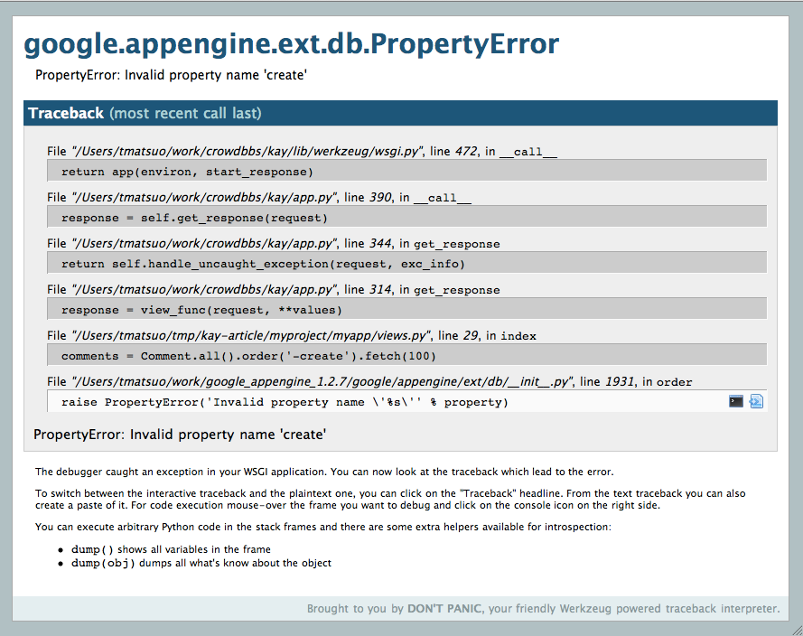
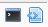
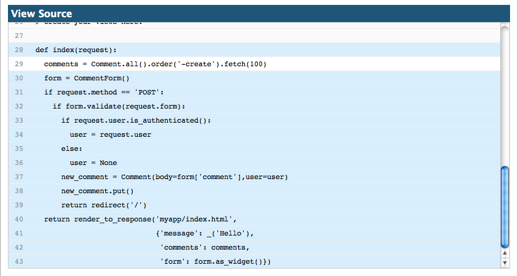
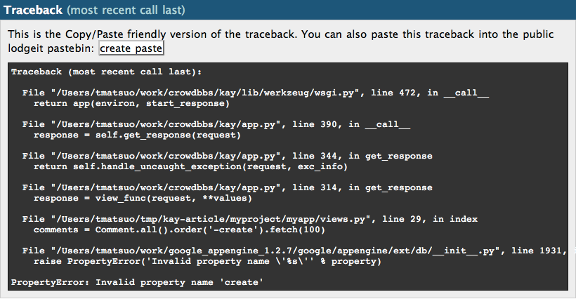
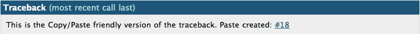

========
デバッグ
========

Werkzeug デバッガ
=================

Kay には Werkzeug のデバッガが塔載されており、ローカルの開発環境で有効になっています。残念ながらサーバー環境では動作しませんのでその点はご注意ください。

このデバッガは、Web Browser 上で動作するようになっており、例外が発生した時に起動します。そして例外発生時のトレースバックの各段階ごとに、インタラクティブコンソールとソースコードを見る機能が利用できます。

また、トレースバックをプレーンテキストで表示したり、インターネット上のペーストサービスに送信する機能もあります。

デバッガ画面
------------

開発サーバー上で例外が発生すると下記のような画面になります。

traceback の各段階ごとに例外の発生した位置とソースコードが表示されます。ソースコードの行にマウスカーソルを合わせると、下記のようなアイコンがその行の右端に表示されます。

左側のアイコンをクリックするとコンソールが表示されます。右側のアイコンをクリックするとソースコードを見る事ができます。

コンソール
----------

コンソール起動時の画面は下記のようになっています。

.. image:: images/debugger-console-startup.png
   :scale: 80

このコンソールでは、トレースバック発生時のフレーム情報を使用して Python コードを実行する事ができるので、デバッグの助けになります。

例えば ``locals()`` と実行すると下記のようにローカル変数の辞書が表示されます。

.. code-block:: python

  [console ready]
  >>> locals()
  {'request': <Request 'http://localhost:8080/' [GET]>}
  >>>

下記のように TYPO を修正してメソッドを実行すればきちんと結果が確認できます。

.. code-block:: python

  [console ready]
  >>> comments = Comment.all().order('-created').fetch(100)
  >>> comments
  [<myapp.models.Comment object at 0x104c6c8d0>]
  >>> 

コンソールを起動するときにクリックしたアイコンをもう一度クリックするとコンソールを非表示にできます。

ソースコード閲覧
----------------

ソースコード表示するアイコンをクリックすると下記のようにソースコードを表示する事ができます。問題が起きた行がハイライトされているのがわかります。

``View Source`` と表記されたタイトル部分をクリックすると、ソースコードを非表示にできます。

ペースト用のトレースバックビュー
--------------------------------

トレースバックをメールに貼り付けたりする時には、下記のタイトル部分をクリックすると便利です。

.. image:: images/debugger-traceback-title.png
   :scale: 80

クリックするとトレースバックの表示方法を、デバッガ／プレーンテキストに交互に変更します。下記はプレーンテキストでトレースバックを表示した画面です。

トレースバックの送信
--------------------

トレースバックをプレーンテキストで表示している時には、「create paste」というボタンがでてきます。このボタンをクリックすろとインターネット上のペーストサービスにトレースバックをペーストする事ができます。ペーストに成功するとそのペーストへのリンクが表示されます。

下記はペーストサービスの画面です。

.. image:: images/debugger-paste-service.png
   :scale: 80

Jinja2 テンプレートでの例外
----------------------------

Jinja2 テンプレート中で例外が起きると、デバッガー上で妙なトレースバックを見る事になります。これは appengine の 制約で ctypes が使用できないのが原因です。回避策としては appengine SDK の dev_appserver.py にパッチを当てる方法があります。

'gestalt' と '_ctypes' を ``_WHITE_LIST_C_MODULES`` リストに加えればきちんとトレースバックが表示されます。

しかし、python dictribution の中には ctypes が壊れているものもあり(例えば最近の macports の python25)、上記の方法では動きません。このような場合は(Kay にバンドルされたものでは無く)別途インストールした jinja2 ディレクトリから _speedups.so を ``kay/lib/jinja2`` にコピーして '_speedups' を ``_WHITE_LIST_C_MODULES`` に加えれば動くようになります。MacOSX を使っているなら、コンパイル済みの _speedups.so を手に入れる一番簡単な方法は py25-jinja2 を macports でインストールする事です。

pdb を使用する
==============

pdb を使用する事もできます。 :func:`kay.utils.set_trace` をプログラムの任意の場所で呼出すとそこでプログラムの実行が中断されます。コンソール上には pdb のプロンンプトが出ているはずです。

例えばここで ``step`` とコマンドを打てばプログラムのステップ実行ができます。pdb の使い方については下記の URL も参照してください。

* http://www.python.org/doc/2.5.4/lib/debugger-commands.html